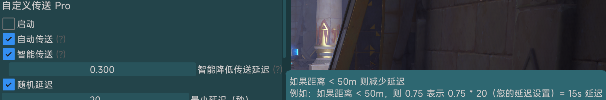
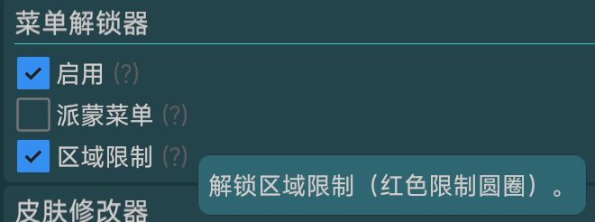

不建议打开【范围拾取】，因为点位做的时候已经做了2m能摸到的都传到中间的，打开范围拾取可能导致摸错其他探索点，浪费了100上限次数.  
  

---
建议打开【智能传送】，增加自动传送效率.  
  

---
建议打开【区域限制】解锁，避免没有开森林书地图导致被派蒙拉走 ~~(虽然应该不太影响?)~~   
  

---
`B线`第`85`点是要赶狸猫才出现的狗粮点，看看你们需不需要，不需要后面我删掉，目前是存在的.  
手动跑路线视频[av992557566](https://www.bilibili.com/video/av992557566 "Bilibili Video")  

---
+ **FAQ1**：为什么我的点位捡到一半后面的都消失了？   
  + 每天放大镜图标的调查点有总互动次数上限100点，这种调查点包括狗粮点、摩拉点、蔬菜点、矿点、甚至部分每日任务中的点位。所以如果你前面摸错了点、导致互动总数提前超过100的话，之后就看不到新的调查点了

  + *注：图标是手形的调查点（如摩拉箱、水钱箱、摩拉石堆等）不与狗粮点冲突   

+ **FAQ2**：如何使用AB路线？

  + 以A路线为主要路线，上线就跑A，如果发现大炮点位没亮再去从权杖厅开始跑B，或者一天A路线一天B路线交替着跑   
  
+ **FAQ3**：为何要做AB双线？
  + 因为大多数圣遗物点的刷新周期是24小时，这样你每天就必须依照前一天捡狗粮的时间开始，是很烦人的，并且并不是所有人都能保证上线时间

  + A+B轮替路线是由两条不重复的路线（会复用12小时周期的点位）组成，并且效率相差不大，这样就能够每天做到随时上线都可以开跑，不用被刷新周期束缚

  + 新双线是在原AB轮替的基础上强调A路线的效率，从而让双线中的A路线也能够承担高效路线的功能，实现N天高效+1天接力轮替，适合每天上线时间比较稳定的同学